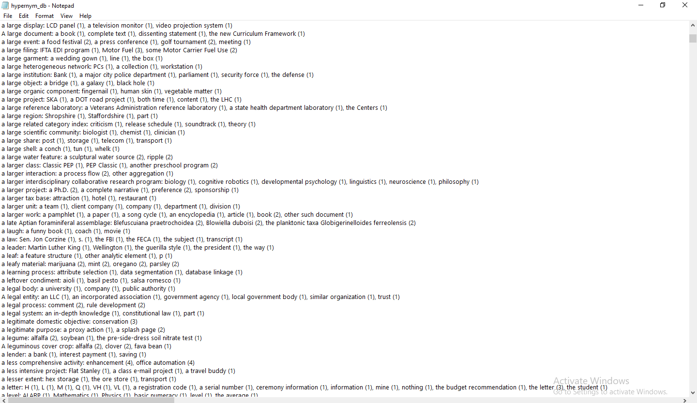

<h4 align="center">


</h4>

<p align="center">
  <a href="##Introduction">Introduction</a> •
  <a href="#Installation">Installation</a> •
  <a href="#Personal Details">Personal Details</a> •
  <a href="#Support">Support</a> 

</p>



## Introduction

**This program has 2 features:**

**1. The ability to read all the files in the directory, find and aggregate hypernym relations that 
match the Hearst patterns
using regular expressions, and save them in a txt file that will look like:**
```
hypernym: hyponym1 (x), hyponym2 (x) ...
hypernym: hyponym1 (x), hyponym2 (x) ...
...
```
**where (x) corresponds to the number of occurrences of the relations (across all possible patterns) in the corpus.**
For each hypernym, the list of co-hyponyms are sorted according to (x) in descending order, for example as follows:
```
country: united kingdom (10), israel (9), japan (9)
```
**2. The ability to search all the possible hypernyms of the input lemma and print them to the console as follows:**
```
hypernym1: (x)
hypernym2: (x)
....
```
**where (x) corresponds to the number of occurrences of the relations
(across all possible patterns) in the corpus.**
The hypernyms are sorted in a descending order according to (x).

<br>

The implementation includes hearst pattern such as:

💥 ``` NP {,} such as NP {, NP, ..., {and|or} NP}.```

In this pattern, the first NP is the hypernym and the NPs after the words "such as" are hyponyms.
Example: "semitic languages such as Hebrew or Arabic are composed of consonants and voyels"
semitic language ⟶ Hebrew
semitic language ⟶ Arabic

💥``` such NP as NP {, NP, ..., {and|or} NP}```

Here again, the first NP is the hypernym and the NPs after the words "as" are hyponyms.
Example: "courses taught by such lecturers as Hemi, Arie, and Hodyah are great"
lecturers ⟶ Hemi
lecturers ⟶ Arie
lecturers ⟶ Hodyah

💥 ```NP {,} including NP {, NP, ..., {and|or} NP}```

Here again, the first NP is the hypernym and the NPs after the words "including" are hyponyms.

💥 ```NP {,} especially NP {, NP, ..., {and|or} NP}```

Here again, the first NP is the hypernym and the NPs after the words "especially" are hyponyms.

💥``` NP {,} which is {{an example|a kind|a class} of} NP```

Here, the first NP is the hyponym and the second in a hypernym. Example: "Object oriented programming,
which is an example of a computer science course" accepts the following: (the "," is optionally)

NP {,} which is NP

NP {,} which is an example of NP

NP {,} which is a kind of NP

NP {,} which is a class of NP


## Installation


### Option 1 - Without Ant
1. Clone the repository:
    ```
    $ git clone https://github.com/TopazAvraham/Regex-Hypernym-Database.git
    ```
2. Download the corpus from [here](https://drive.google.com/drive/folders/11aVnX9r-k5iy2GafZd-o5lBBgeNRuFDN?usp=sharing)
3. Open the project from an IDE such as Intellij, Eclipse, etc.
4. Make sure an updated jdk is set in the configuration, and the src folder of Arkanoid is set as the source root.
5. Create configuration with CreateHypernymDatabase as the Main Class, and add 2 agruments:
   * first- The directory path of the corpus.
   * second- name for the new txt file
6. run it, and enjoy!


### Option 2 - With Ant
1. Clone the repository:
    ```
    $ git clone https://github.com/TopazAvraham/Regex-Hypernym-Database.git
    ```
2. Download the corpus from [here](https://drive.google.com/drive/folders/11aVnX9r-k5iy2GafZd-o5lBBgeNRuFDN?usp=sharing)
3. Install [Apache Ant](https://ant.apache.org/bindownload.cgi) Link to a guide: [Apache Ant Installation Video Windows](https://www.youtube.com/watchv=3eaW81yYIqY&t=353s&ab_channel=xscourse)
4. Open CMD in the cloned directory and run this command:
    ``` 
   ant compile
   ant run1 (first argument- The directory of the corpes, Second argument- name for the new txt file)
   ant run2 (first argument- The directory of the corpes, Second argument- a lemma)
   ``` 
## Built With

- Java


## Personal Details

**Topaz Avraham**

- [Profile](https://github.com/TopazAvraham?tab=repositories )
- [Email](mailto:topazavraham9@gmail.com?subject=Hi "Hi!")
- [LinkedIn](https://www.linkedin.com/in/topaz-avraham-68b340208/ "Welcome")

## 🤝 Support

Contributions, issues, and feature requests are welcome!

Give a ⭐️ if you like this project!
